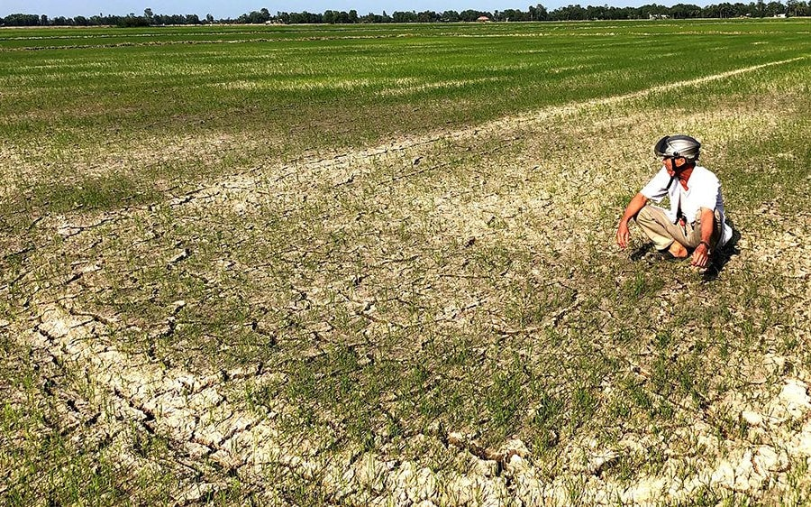

#
#
<link rel="stylesheet" href="style.css" type="text/css">

Picture showing the a rice field affected by saltwater intrusion in the Mekong Delta, Vietnam
Source: https://baotainguyenmoitruong.vn/ngap-man-o-dong-bang-song-cuu-long-ptag.html 

### **Objectives of the project**
The project has two main objectives: 1. evaluate how and to what extent saltwater intrusion affects agricultural production in the Mekong Delta under uncertainty, and 2) to what extent the expected reduction in rice production in the Mekong Delta affects price for rice and trade internationally. 

### **Publications** 
1). **Tran, D.Q**., Le, N. K., Durand-Morat, A., Nguyen, N.T. N., Bairagi, S., Huynh, V.T. M & Tran, V. T. 2025. [Is It Worth It? Land-fallowing and Saltwater Intrusion Control Under Uncertainty](https://authors.elsevier.com/a/1kYnzB8cd44R0). Science of the Total Environment. 966 (2025), 1-15.

2). **Tran, D.Q.**, Nguyen, N.T. N., Huynh, V.T. M., Bairagi, S., Le, N. K., Tran, V. T & Durand-Morat, A. 2023. [Modeling Saltwater Intrusion Risk in the Presence of Uncertainty](https://doi.org/10.1016/j.scitotenv.2023.168140). Science of the Total Environment. 908, 168140. [Preprint version can be accessed here](https://papers.ssrn.com/sol3/papers.cfm?abstract_id=4510877). 

