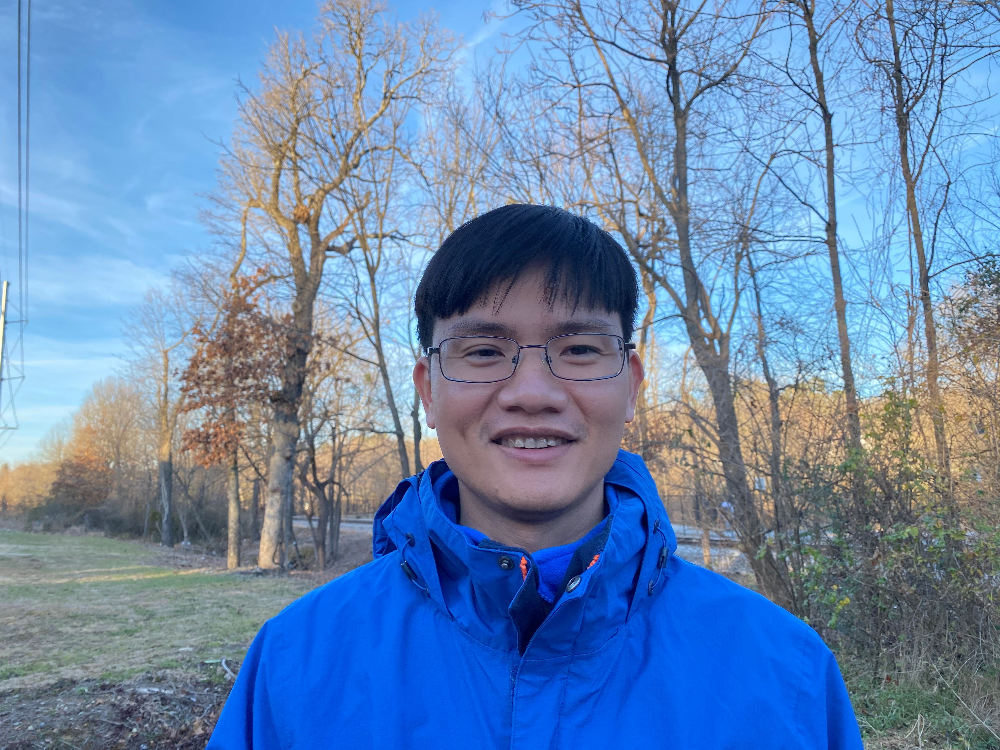

#
#
<link rel="stylesheet" href="style.css" type="text/css">

<!--  -->

<!--  -->

Hello, this is Dat. Currently, I work as an economist in the Florida Legislature, Office of Economic and Demographic Research (EDR). Before joining EDR, I was a post-doc at the University of California, Riverside (2020-2021), the University of Arkansas, Fayetteville (2018-2020), and the North Carolina A&T State University (2017).

Broadly speaking, I am an interdisciplinary scholar. I am interested in the nexus between humans and the environment, the tools and methodologies we use to understand it, the policies we adopt to change it, and the pedagogy of teaching it.

**My research interests** can be broken down into three main categories: **technology adoption**, **water resource management policies**, and **interactions between hydro-biophysical and economic systems**. I study these topics using theoretical, empirical, numerical, and bio-physical process-based modeling approaches. 

With the availability of large geo-referenced datasets, I increasingly spend time on machine learning and data analytics applications with process-based and statistical models to support Food-Water-Energy Nexus research. Being an engineer by training, I am involved in several interdisciplinary research projects. I collaborate extensively with soil and environmental scientists, civil engineers, hydrologists, and economists.

<!-- #### -->
<!-- #### **Technology Adoption** -->
<!-- ### -->
<!-- ### -->

<!-- ### -->
<!-- #### **Resource Management Policies** -->
<!-- ### -->

<!-- ### -->
<!-- #### **Interactions Between Hydro-Biophysical and Economic System** -->
<!-- ### -->

